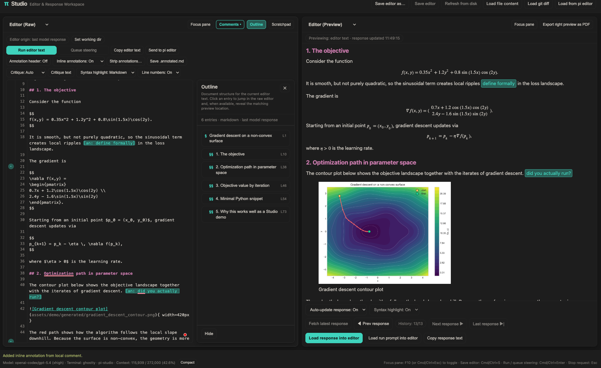
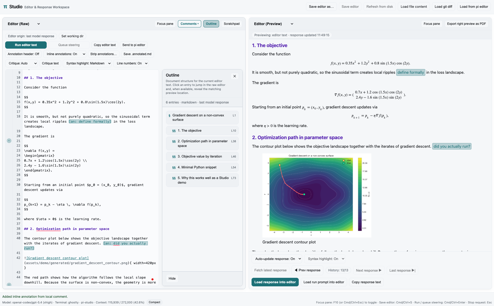

# pi-studio

Extension for [pi](https://pi.dev) that opens a local two-pane browser workspace for working with prompts, responses, live working details, Markdown and LaTeX documents, interactive HTML previews, code files, REPL sessions, and other common text-based files side by side. Annotate responses and files, add local comments, write, edit, run prompts, send code to a REPL, browse prompt and response history, request critiques, and use live preview for code, Markdown, LaTeX, and interactive HTML.

## Quick demo

[Watch the 2-minute demo (MP4, 2x speed, no audio)](https://github.com/omaclaren/pi-studio/releases/latest/download/pi-studio-demo-2min.mp4)

## Screenshots

**Dark**



**Light**



## What it does

- Opens a two-pane browser workspace: **Editor** (left) + **Response/Working/Editor Preview** (right)
- Supports one canonical full Studio view per Pi session, plus additional editor-only companion views when you want extra editing/preview surfaces; editor-only views can also browse files and use the Studio REPL send controls without taking over the full Studio session view
- Includes a global **Zen** mode for hiding secondary Studio chrome without changing the current left/right pane layout
- Runs editor text directly, asks for structured critique (auto/writing/code focus), offers a manual **Suggest completion** action for short cursor-aware continuations (`Option/Alt+Tab` where available or `Cmd/Ctrl+Shift+Space` from the editor, `Tab` to insert a visible suggestion) with an optional editor-plus-latest-response context mode, or opens **Quiz me** for a Studio-native active-recall loop over the current editor text, selection, current file, folder, or repo, with optional focus guidance for shaping question selection
- Includes a live **Working** view for following current model/tool activity, with `All` / `Thinking` / `Tools` filters, image previews for image-producing tool outputs, plus **Load visible into editor** and **Copy visible** actions; when cycling response history, Working follows saved working details for the selected response when available, and `Cmd/Ctrl+Alt+W` switches the right pane directly to Working
- Includes a right-pane **Changes** view for browsing the current git diff by file, previewing per-file diffs, opening changed files, loading the full diff into the editor, and copying the diff
- Includes a right-pane **Files** view for browsing the current Pi session/resource directory, opening folders, opening the Files root in Finder/the system file manager, loading text/code/CSV/TSV documents into the editor, previewing PDFs/images, opening PDF/image previews in a new Studio tab, converting DOCX/ODT documents to editable Markdown when Pandoc is available after confirmation, copying paths, setting the current folder as the Studio working directory, and revealing files in the file manager
- Includes an optional tmux-backed **REPL** view for Shell, Python, IPython, Julia, R, GHCi, and Clojure sessions, with Raw/Literate send modes, `Cmd/Ctrl+Shift+Enter` **Send to REPL**, session start/stop/interrupt controls, a compact refresh-persistent **Studio REPL Record** of user and Pi-sent code, a secondary raw tmux mirror, agent-facing `studio_repl_status` / `studio_repl_send` tools, and Markdown/PDF/HTML export
- Includes a local persistent scratchpad for quick notes you want to keep out of the main editor until you're ready to copy or insert them, with a **Recent…** picker for recovering scratchpads saved under earlier file/draft identities
- Includes a docked **Outline** rail for navigating document structure in the current editor text, with clickable entries that jump in the raw editor and reveal matching preview locations when available
- Restores the current browser-tab editor workspace after refresh and provides an explicit **Reset editor** action when you want to discard the restored draft and return the tab to a fresh blank draft without changing responses or saved files
- Turns local preview links, including links inside sandboxed HTML previews, into Studio actions: PDFs open in the embedded viewer, images open in a zoomable focus viewer, PDF/image links can open in a new Studio preview tab, text/code/CSV/TSV document links can open in a new editor tab, DOCX/ODT links can be converted to editable Markdown, and right-click menus provide **Open here**, **Reveal in file manager**, and **Copy path** for local resources
- Includes local comments anchored to selections/lines, shown in a docked **Comments** rail, with transient **Comment** / **Jump** actions from raw-editor selections plus editor-preview selections for Markdown, LaTeX, code/text/diff previews, and an opt-in comment mode for editor HTML previews; source-anchored comments can be toggled into inline `[an: ...]` annotations when you want comments reflected in the document text
- Browses response history (`Prev/Next/Last`) and loads either:
  - response text
  - critique notes/full critique
  - the prompt that generated a selected response
- Supports an annotation workflow for `[an: ...]` markers:
  - inserts/removes the annotated-reply header
  - shows/hides annotation markers in preview
  - strips markers before send (optional)
  - saves `.annotated.md`
- Renders Markdown/LaTeX/code previews (math + Mermaid) plus lightweight CSV/TSV table previews, theme-synced with pi, with copy buttons for code blocks and blockquotes
- Renders straight, unfenced interactive HTML in preview via a sandboxed browser iframe with zoom controls, while fenced `html` blocks remain source code
- Embeds local PDFs in Studio Markdown previews via explicit `studio-pdf` fenced blocks, with a Focus action for temporarily enlarging the embedded viewer
- Ships optional `pi-studio-dark` and `pi-studio-light` themes tuned for Studio's browser workspace
- Exports right-pane preview as PDF (pandoc + LaTeX) or standalone HTML into the source file directory, Studio working directory, or Pi session directory; PDF export can open in a Studio preview tab or the default PDF viewer, and HTML export can open in the default browser or in a new Studio editor tab for inspection/commenting, while preserving authored HTML previews as HTML and rendering CSV/TSV editor previews as tables
- Exports local files headlessly via `/studio-pdf <path>` to `<name>.studio.pdf` or `/studio-html <path>` to `<name>.studio.html`; without a path, those commands export the last model response to a timestamped file. Agent tools `studio_export_pdf` and `studio_export_html` expose the same export pipeline for remote/Telegram-style sessions.
- Shows model/session/context usage in the footer, plus a compact-context action

## Commands

| Command | Description |
|---|---|
| `/studio` | Open with last assistant response (fallback: blank) |
| `/studio <path>` | Open with file preloaded |
| `/studio --last` | Force last response |
| `/studio --blank` | Force blank editor |
| `/studio --no-browser` | Start/print the Studio URL without opening a browser, useful for forwarded or phone/browser sessions |
| `/studio --port <port>` | Bind Studio to a fixed localhost port instead of a random free port |
| `/studio --status` | Show studio server status |
| `/studio --stop` | Stop studio server |
| `/studio --help` | Show help |
| `/studio-replace [path\|--blank\|--last]` | Replace the current full Studio view with a new full Studio view |
| `/studio-editor-only [path\|--blank\|--last]` | Open an editor-only Studio view; multiple editor-only views may be open at once |
| `/studio-current <path>` | Load a file into currently open Studio tab(s) without opening a new browser window |
| `/studio-pdf [path] [options]` | Export a local file, or the last model response when no path is given, via the Studio PDF pipeline |
| `/studio-html [path]` | Export a local file, or the last model response when no path is given, to standalone HTML via the Studio preview pipeline |

## Agent tools

| Tool | Description |
|---|---|
| `studio_export_pdf` | Export direct Markdown/LaTeX, a local file, or the last model response to PDF. Defaults to writing a file without opening a viewer. |
| `studio_export_html` | Export direct Markdown/LaTeX, a local file, or the last model response to standalone HTML. Defaults to writing a file without opening a viewer. |

## Install

```bash
# npm
pi install npm:pi-studio

# GitHub
pi install https://github.com/omaclaren/pi-studio
```

Run once without installing:

```bash
pi -e https://github.com/omaclaren/pi-studio
```

## Studio Markdown extras

Studio previews standard Markdown, code fences, display math, Mermaid, and local images. When adding companion files such as generated plots or PDFs, prefer the project's existing folder convention. If there is no convention, `attachments/` is a reasonable default for newly generated assets. Use relative paths from the opened Markdown file or Studio working/resource directory, and wrap paths in angle brackets when spaces are possible:

```md

```

Local PDFs can be embedded with an explicit Studio-only fenced block:

````md
```studio-pdf
path: attachments/paper.pdf
title: Optional title
page: 3
height: 760
caption: Optional caption
```
````

`path` must point to a local `.pdf` within the current Studio resource directory. Relative paths resolve from the opened document's directory, or from Studio's working dir for non-file-backed content. `page` is an initial page hint for the browser PDF viewer, and `height` controls the embedded frame height in pixels. Use normal Markdown links for PDFs when embedding is not useful.

## Notes

- Local-only server (`127.0.0.1`) with tokenized Studio URLs.
- For remote SSH sessions, keep Studio bound to localhost and use SSH local port forwarding; `/studio` and `/studio --status` print the full tokenized localhost URL. The SSH hint repeats the full URL so it is visible even if your terminal only shows the latest notification. Open that URL through the tunnel, preserving the `?token=...` parameter. If SSH is not auto-detected, use `/studio --no-browser`; for stable forwarding, use `/studio --port <port>` or combine them, e.g. `/studio --no-browser --port 3417`.
- Full Studio is a singleton per Pi session: use `/studio` to open it, `/studio-replace` to explicitly replace it, and `/studio-editor-only` for extra editing/preview tabs that do not take over the full Studio session view.
- Studio is designed as a complement to terminal pi, not a replacement.
- Installing pi-studio makes the optional `pi-studio-dark` and `pi-studio-light` themes available in pi's theme selector; it does not change your active theme.
- Editor/code font uses a best-effort terminal-monospace match when the current terminal config exposes it; set `PI_STUDIO_FONT_MONO` to force a specific CSS `font-family` stack. Use `PI_STUDIO_FONT_UI` or `PI_STUDIO_FONT_PROSE` to override the Studio UI or rendered-preview font stacks.
- The optional REPL view requires `tmux`. Studio can start and stop Studio-owned `pi-studio-repl-*` sessions and can mirror detected `pi-repl-*` sessions, but it will not stop external `pi-repl-*` sessions.
- Full preview/PDF quality depends on `pandoc` (and `xelatex` for PDF):
  - `brew install pandoc`
  - install TeX Live/MacTeX for PDF export
- Export subprocess timeouts default to bounded values and can be tuned with `PI_STUDIO_PANDOC_TIMEOUT_MS`, `PI_STUDIO_LATEX_TIMEOUT_MS`, `PI_STUDIO_MERMAID_TIMEOUT_MS`, and `PI_STUDIO_HTML_RENDER_OUTPUT_MAX_BYTES` for unusually large embedded-asset HTML exports.
- Mermaid diagrams in exported PDFs may also require Mermaid CLI (`mmdc` / `@mermaid-js/mermaid-cli`) when you want diagram blocks rendered as diagrams rather than left as code.

## License

MIT
